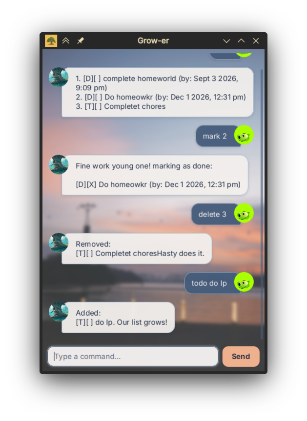

# Grow-er User Guide

Grow-er is a desktop task manager for tracking to-dos, deadlines, and events using text commands. Your tasks are saved automatically between sessions.



## Features

- **Three task types:** Create to-dos, deadlines, and events with start and end times.
- **Completion tracking:** View all tasks and mark them as completed or incomplete.
- **Task management:** Delete tasks, search descriptions, and sort tasks by time.
- **Automatic saving:** Keep your tasks and completion status between sessions.
- **Chat-style interface:** Enter text commands and see responses in a scrollable conversation.
- **Helpful errors:** Get feedback on invalid commands, dates, and task numbers.

## Quick start

1. Install **Java 25**. Check your version by running `java -version` in a terminal.
2. Check [Releases](https://github.com/liownahum/ip/releases) for `grower.jar` and place it in a folder of your choice. If no JAR is available, build it from the source as described below.
3. Open a terminal in that folder and run:

   ```sh
   java -jar grower.jar
   ```

4. Type `todo read book` in the input box and press **Enter** or click **Send**. Then try `list` and `mark 1`.

**Building from source:** With JDK 25 installed, run `./gradlew shadowJar` from the project folder (Windows: `gradlew.bat shadowJar`). The JAR is created at `build/libs/grower.jar`.

## Command summary

Replace text inside `<...>` with your own values; do not type the angle brackets. Enter one command per line.

| Action | Format | Example |
| --- | --- | --- |
| Add a to-do | `todo <description>` | `todo read book` |
| Add a deadline | `deadline <description> /by <date-time>` | `deadline submit report /by 20/9/2026 1800` |
| Add an event | `event <description> /from <date-time> /to <date-time>` | `event meeting /from 20/9/2026 1400 /to 20/9/2026 1530` |
| List all tasks | `list` | `list` |
| Mark as completed | `mark <number>` | `mark 1` |
| Mark as incomplete | `unmark <number>` | `unmark 1` |
| Delete a task | `delete <number>` | `delete 1` |
| Search descriptions | `find <text>` | `find book` |
| Sort tasks by time | `sort` | `sort` |
| Repeat your text | `echo <text>` | `echo hello` |
| End the session | `bye` | `bye` |

## Things to know

- **Dates and times:** Use `d/M/yyyy HHmm` with a 24-hour clock and no colon, e.g. `20/9/2026 1800` means 20 September 2026 at 6 PM. An event must end after it starts.
- **Task numbers:** Use numbers from the latest `list`, starting at **1**. Search results have separate numbering; run `list` before marking, unmarking, or deleting. Sorting and deleting can change task numbers.
- **Task display:** `[T]`, `[D]`, and `[E]` identify to-dos, deadlines, and events. `[X]` means completed; `[ ]` means incomplete.
- **Searching:** `find` matches descriptions containing the supplied text, including partial words. Matching is case-sensitive.
- **Sorting:** Undated tasks come first, followed by dated tasks from earliest to latest, using deadline times or event **end times**.
- **Input:** Descriptions cannot be empty or contain `|`. The commands `list`, `sort`, and `bye` take no arguments.
- **Ending a session:** `bye` displays a farewell and disables input in the GUI. Close the window to exit; reopen the app to start another session.

## Saving and troubleshooting

Changes are saved immediately to `data/grower.txt`, relative to the folder where you launch the app. Launch from the same folder each time to load the same tasks. Deleting a task has no undo command.

- **Invalid command:** Check the format above and the error message, then try again.
- **Could not save tasks:** The change was not applied. Check the data folder's write permissions and available disk space, then retry.
- **Could not load tasks or invalid saved data:** Changes are disabled to protect the file; successfully loaded tasks remain viewable. Back up `data/grower.txt`, fix the reported file or access problem, and restart the app.
